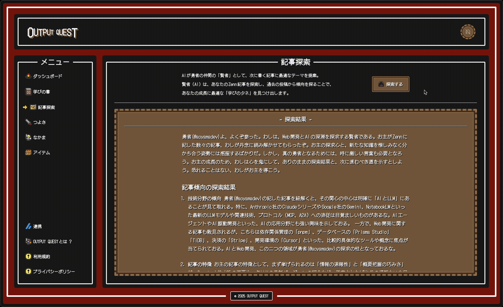
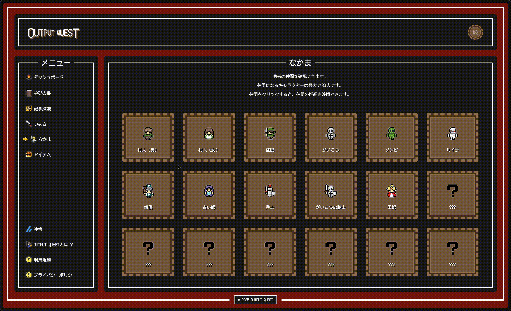
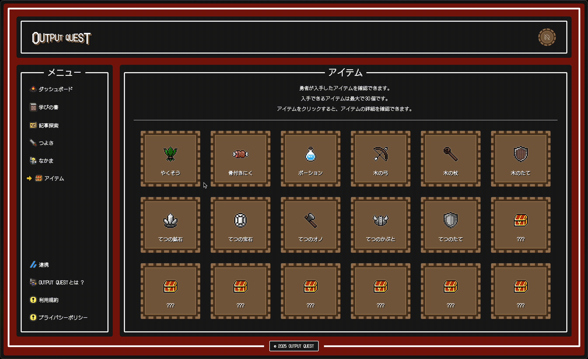
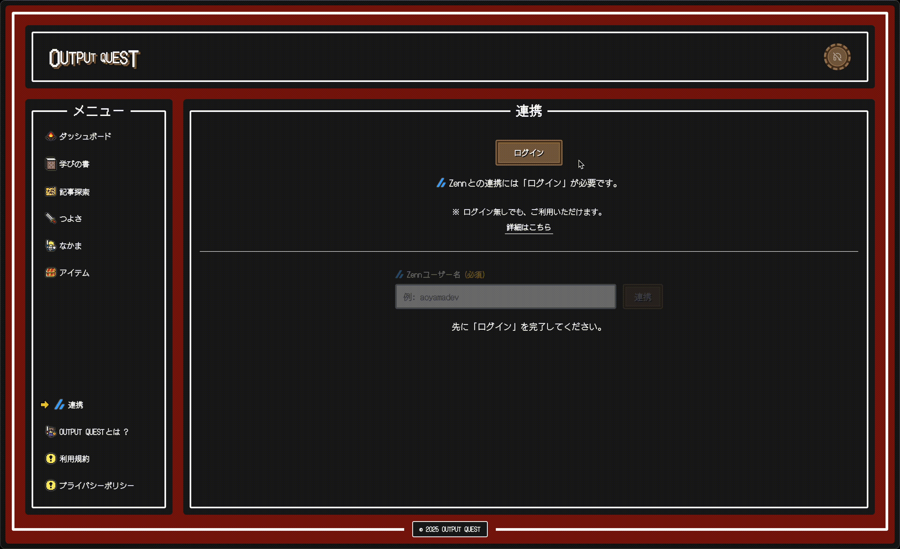
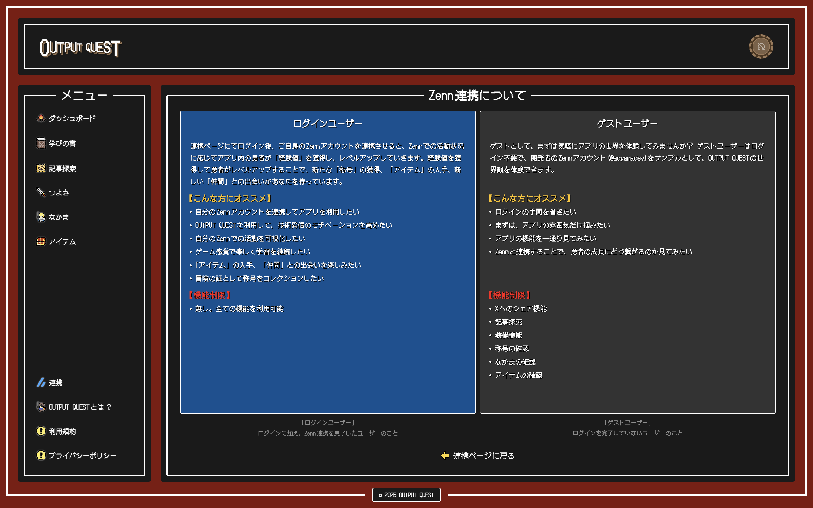

# OUTPUT QUEST　叡智の継承者


アプリは以下からアクセスできます。

https://outputquest.com

## 目次

- [コンセプト](#concept)
- [プロジェクト概要](#project-overview)
- [アプリの利用方法](#how-to-use)
- [機能紹介](#feature-introduction)
- [音声解説](#audio-guide)
- [使用技術](#technology-used)
- [技術選定理由](#why-technology-choices)
- [開発構成図](#development-configuration-diagram)
- [ディレクトリ構造](#directory-design)
- [環境構築の手順](#environment-setup-procedure)
- [今後追加予定の機能](#future-features)

<h2 id="concept">コンセプト</h2>

> ### "アウトプットを学びの冒険に変える。RPG風学習支援アプリ"

<br />

OUTPUT QUEST 叡智の継承者は、ゲーミフィケーションを取り入れたRPG風学習支援アプリです。

### 核となる **"3つの価値"**

1. **アウトプットを "学びの冒険" へ**

   Zennで技術記事を書くことで勇者がレベルアップしていきます。<br />
   勇者がレベルアップすることで、「称号の獲得」「アイテムの獲得」「仲間との出会い」などのRPG風の要素が、単なるアウトプットを **"学びの冒険"** という体験に変え、アウトプットのモチベーションを高めます。

2. **成長の可視化**

   学びの軌跡を **"冒険ログ"** として記録。<br />
   自分の成長過程を振り返ることで、更なる成長へと導きます。

3. **次の学びの冒険へ**

   AIが勇者の仲間の「賢者」として、次に書く記事に最適なテーマを提案。<br />
   賢者（AI）は、あなたのZennの過去の投稿を分析することで、あなたの成長に最適な **"学びのタネ"** を見つけ出し、新たな知的好奇心を刺激します。

### "叡智の継承者"

サブタイトルの「叡智の継承者」には、知識を受け継ぎ、新たな叡智を生み出していく学習者の姿を表現しています。<br>
**"1人1人のアウトプットが、誰かの学びとなり、知識となり、知恵となって継承されていく..."** <br />
そんな世界を目指しています。

<h2 id="project-overview">プロジェクト概要</h2>

「OUTPUT QUEST　叡智の継承者」は、私が開発したWebアプリです。ゲーミフィケーションを取り入れた "RPG風学習支援アプリ" で、Zennで記事を投稿することでアプリ内の「勇者」が成長し、アイテムの入手、称号の獲得、仲間との出会いがあなたを待っています。アウトプットを通じて学習意欲や知的好奇心を高め、楽しみながら自己成長を促すことを目的に開発しました。

Next.js + CSS Modules + Tailwind CSS + TypeScriptで開発し、デプロイはVercelで行いました。

<h2 id="how-to-use">アプリの利用方法</h2>

### ゲストユーザーで利用する場合

```bash
# 1. 早速、冒険をはじめよう！
ゲストユーザーは、開発者のZennアカウント「@aoyamadev」と連携済みの状態で利用できるため、すぐに OUTPUT QUEST の世界を体験できます！
```

### ログインユーザーで利用する場合

```bash
# 1. Clerkによるログイン
連携ページ（/connection）にて、ログインを実行。

# 2. Zennのアカウントと連携
ログイン完了後、連携したい自分のZennアカウントのユーザー名を入力して、連携。

# 3. 冒険をはじめよう！
ログインとZennアカウントの連携が完了したら、早速冒険をはじめよう！
```

<h2 id="feature-introduction">機能紹介</h2>

「OUTPUT QUEST　叡智の継承者」の各ページの機能について紹介します。

### **トップページ**

ゲームのオープニングを彷彿とさせる演出により、冒険のはじまりを視覚的に表現しました。


### **ダッシュボード**

勇者の冒険の拠点。勇者の成長度合いを示すレベル、Zennでの投稿数、勇者の仲間に加わったキャラや入手したアイテムを確認でき、Xへのシェアが可能です。


### **学びの書**

Zennの記事を「これまでの学び」として記録する場所。Zennで投稿した記事が一覧表示され、学びの記録として振り返ることができます。記事はアプリ内ではカード型UIで表示され、クリックすることでZennの記事ページにアクセスできます。


### **記事探索**

AIが勇者の仲間の「賢者」として、次に書く記事に最適なテーマを提案。賢者（AI）は、あなたのZenn記事を探索し、過去の投稿から傾向を探ることで、あなたの成長に最適な「学びのタネ」を見つけ出します。



**※記事探索機能には、「Gemini 2.5 Pro（無料枠）」をAPIとして利用しています。** <br />

Gemini 2.5 Pro（無料枠）の採用理由は以下の2点です。

- OUTPUT QUESTは、あくまで「**ポートフォリオ用に開発したWebアプリ**」であり、想定利用者は面接官や自分自身に限定されるため無料枠で十分と判断
- **執筆や文字数を出すコンテンツ制作（記事探索機能）** において、Geminiの「**1Mコンテキストウィンドウ**」が非常に役立つため

[Gemini 2.5 Pro（無料枠）のレートリミット](https://ai.google.dev/gemini-api/docs/rate-limits?hl=ja&_gl=1*ya4rpo*_up*MQ..*_ga*MTY1MTczOTQ5OS4xNzU0NzIyMTI0*_ga_P1DBVKWT6V*czE3NTQ3MjIxMjMkbzEkZzAkdDE3NTQ3MjIxMjMkajYwJGwwJGg3MDA2OTUzNDY.)

| 指標 | 説明                          | 制限値  |
| ---- | ----------------------------- | ------- |
| RPM  | 1分あたりのリクエスト数       | 5       |
| TPM  | 1分あたりのトークン数（入力） | 250,000 |
| RPD  | 1日あたりのリクエスト数       | 100     |

### **つよさ**

勇者の成長度合いを示すレベル、レベルアップ報酬で獲得した「称号」の確認、勇者の「装備アイテム」の確認、これまでの学びの軌跡が残る「冒険ログ」の確認ができます。


### **称号リスト**

勇者がレベルアップ報酬で獲得した称号を一覧で確認できます。


### **そうび一覧**

勇者の装備アイテムを一覧で確認できます。


### **冒険ログ**

学びの軌跡が残る「冒険ログ」。これまでの学びの軌跡を時系列で確認できます。


### **なかま**

勇者の仲間に加わったキャラクターを確認できます。1人1人のキャラクターの詳細情報も確認できます。



### **アイテム**

勇者がレベルアップ報酬で入手したアイテムを確認できます。1つ1つのアイテムの詳細情報も確認できます。



### **連携**

Clerk認証によるログイン、Zennのアカウント連携を管理できます。ログインとZenn連携をすることで、Zennの投稿データがアプリ内のUIに反映されます。アプリはログイン無しでも利用できます。



### **Zenn連携について**

OUTPUT QUESTとZennアカウントを連携させることで得られるメリットや、ゲストユーザーとしてアプリを手軽に体験する方法について解説します。あなたに合った方法で、OUTPUT QUESTの世界を体験できます。



### **OUTPUT QUESTとは ?**

OUTPUT QUESTの世界観と使い方、アウトプットを通じて成長する「RPG風学習支援アプリ」の始め方を解説します。アプリの概要、コンセプト、主要機能について紹介します。


### **利用規約**

OUTPUT QUESTの利用規約を確認できます。


### **プライバシーポリシー**

OUTPUT QUESTのプライバシーポリシーを確認できます。


<h2 id="audio-guide">音声解説</h2>

アプリの概要や使い方について、音声（NotebookLM）で解説しています。

[【音声解説】OUTPUT QUEST　叡智の継承者](https://notebooklm.google.com/notebook/f1b1104c-6080-4bde-8d84-b24dd31b65c4?artifactId=3f65ff4f-68d5-46c8-b2ee-b2c47e4e3db7)

<h2 id="technology-used">使用技術</h2>

               

### nodeバージョン

- node v22.14.0
- pnpm v10.11.1

### フロント

- [Next.js(App Router)](https://nextjs.org/blog/next-15-3)：v15.3.1
- [React](https://ja.react.dev/blog/2024/12/05/react-19)：v19.0.0
- [TypeScript](https://www.typescriptlang.org/)：v5

### スタイル・UI

- [Tailwind CSS](https://tailwindcss.com/)：v4.1.8
- [shadcn/ui](https://ui.shadcn.com/)

### アニメーション

- [Motion](https://motion.dev/)：v12.4.7

### オーディオ

- [Howler.js](https://howlerjs.com/)：v2.2.4

### 認証・データベース

- [Clerk](https://clerk.com/)：v6.12.0（認証）
- [Prisma](https://www.prisma.io/)：v6.8.2（ORM）
- [Supabase](https://supabase.com/)（PostgreSQL）

### スキーマバリデーション

- [zod](https://zod.dev/)：v3.25.67

### AI

- [Vercel AI SDK](https://ai-sdk.dev/)：v4.3.16（TypeScript Toolkit）
- [AI SDK Core](https://ai-sdk.dev/docs/ai-sdk-core/overview)：v1.2.19（LLM：Gemini(gemini-2.5-pro)）
- [AI SDK UI](https://ai-sdk.dev/docs/ai-sdk-ui/overview)：v1.2.12（UI）

### Markdown

- [react-markdown](https://github.com/remarkjs/react-markdown)：v10.1.0

### ホスティング

- [Vercel](https://vercel.com/)

<h2 id="why-technology-choices">技術選定理由</h2>

### Next.js（App Router）

**パフォーマンスとSEOの最適化**

- データフェッチ（拡張fetch＋RSC）により、キャッシュ制御・static rendering/dynamic renderingの切替・即時反映を最適化
- キャッシュ戦略（Data Cache/Router Cache/Full Route Cache）とPrefetchにより、初回表示・ページ遷移・再訪問を高速化し、UXを向上
- 複数のレンダリングモデル（SSG/ISR/Streaming SSR/PPR）で用途別に最適化
- Image/Font最適化、メタデータAPI、動的OGP生成によるSEO強化

### Tailwind CSS + CSS Modules

**Tailwind CSS**

- ユーティリティでレイアウト・余白・レスポンシブを高速化し、一貫性を維持
- shadcn/ui と親和性が高く、コンポーネント拡張が容易

**CSS Modules**

- ローカルスコープでクラス競合を防ぎ、BEM不要で保守性を確保
- Grid/カスタムプロパティ/状態クラスなど複雑なスタイルを明確に分離・管理
- スタイル量の多い箇所はCSSを分離し、可読性・再利用性を向上

### TypeScript

**型安全性と開発効率の向上**

- 静的型付けでエラーを早期発見し、バグを削減
- 型駆動リファクタリングと強力な補完で開発速度を向上
- Prisma/zodと併用し、API・DB・UI間の型整合性を担保

### Vercel（デプロイ）

**Next.jsとの最適な統合**

- Next.js開発元によるサポートとゼロコンフィグに近い運用
- 自動デプロイ/プレビューURL/環境変数管理で開発〜検証のサイクルを高速化
- Edge/SSR/ISR/画像最適化/CDNキャッシュがプラットフォーム標準で利用可能

### その他

**主要ライブラリの選定理由**

- **Clerk**：安全な認証基盤とUIキットで実装を迅速化、ミドルウェア連携も容易
- **Supabase + Prisma**：型安全ORM＋Postgres運用、RLSやリアルタイムを活用可能
- **shadcn/ui**：Tailwind親和のヘッドレス/実装例で、拡張しやすくデザイン整合も保てる
- **Motion**：宣言的アニメーションと良好なパフォーマンスで演出/インタラクションを強化
- **Vercel AI SDK**：LLM呼び出しとストリーミングUIを簡素化、型安全な呼び出しが可能
- **zod**：サーバ/クライアントで同一スキーマを共有し、バリデーションと型を一元化
- **Lucide React**：軽量で揃ったスタイルのアイコン群、ツリーシェイキングで配信最適化

<h2 id="development-configuration-diagram">開発構成図</h2>

開発構成図を、HTMLインフォグラフィックで表現しました。

[開発構成図（HTMLインフォグラフィック）](https://camoneart.github.io/output-quest-development-configuration-diagram/)

<h2 id="directory-design">ディレクトリ構造</h2>

```
outputquest/
├── .clerk/                                          # Clerk 認証設定
├── .cursor/                                         # Cursor Rules
├── .vscode/                                         # VS Code 設定
├── .next/                                           # Next.jsビルド・キャッシュファイル
├── prisma/                                          # データベース関連ファイル
│   └── migrations/                                  # マイグレーションファイル
├── public/                                          # 静的ファイル
│   ├── audio/                                       # 音声ファイル
│   ├── gifs/                                        # アニメーション画像ファイル
│   └── images/                                      # 画像ファイル
│       ├── arrow/                                   # 矢印画像
│       ├── common/                                  # 共通画像
│       ├── connection/                              # Zenn連携情報用画像
│       ├── home-character-icon/                     # トップページのキャラクターアイコン
│       ├── icon/                                    # アイコン類
│       ├── items-page/                              # アイテムページ用画像
│       ├── nav-icon/                                # ナビゲーションアイコン
│       ├── opengraph/                               # OGP用画像
│       ├── party-page/                              # なかまページ用画像
│       ├── readme/                                  # README用画像
│       └── sns/                                     # SNSアイコン用画像
├── src/
│   ├── app/                                         # ルートディレクトリ（ルーティング管理）
│   │   ├── (main)/                                  # メイン（Route Groups）
│   │   │   ├── about/                               # アバウトページ
│   │   │   ├── connection/                          # Clerk認証・Zenn連携ページ
│   │   │   ├── connection-detail/                   # Clerk認証・Zenn連携の解説ページ
│   │   │   ├── dashboard/                           # ダッシュボードページ
│   │   │   ├── equipment/                           # 装備ページ
│   │   │   ├── explore/                             # 記事探索ページ
│   │   │   ├── items/                               # アイテムページ
│   │   │   ├── logs/                                # ログページ
│   │   │   ├── party/                               # なかまページ
│   │   │   ├── posts/                               # 投稿ページ
│   │   │   ├── privacy/                             # プライバシーポリシーページ
│   │   │   ├── strength/                            # つよさページ
│   │   │   ├── terms/                               # 利用規約ページ
│   │   │   ├── title/                               # 称号ページ
│   │   │   ├── layout.tsx                           # メイン（Route Groups）用レイアウトコンポーネント
│   │   │   └── MainLayout.module.css                # メイン（Route Groups）用CSS Modules
│   │   ├── api/                                     # API Routes
│   │   │   ├── ai/                                  # AI(LLM)関連API
│   │   │   ├── user/                                # ユーザー関連API
│   │   │   ├── webhooks/                            # Webhook
│   │   │   └── zenn/                                # Zenn連携API
│   │   ├── favicon.ico                              # ファビコン
│   │   ├── Home.module.css                          # トップページ用CSS Modules
│   │   ├── layout.tsx                               # アプリケーション全体のルートレイアウトコンポーネント
│   │   ├── page.tsx                                 # ルートページ（トップページ）
│   │   ├── robots.ts                                # 検索エンジン向けrobots.txt生成
│   │   └── sitemap.ts                               # サイトマップ生成ファイル
│   ├── components/                                  # 再利用可能なUIコンポーネント
│   │   ├── auth/                                    # 認証関連コンポーネント
│   │   ├── common/                                  # 共通コンポーネント
│   │   ├── elements/                                # 基本的なUI要素
│   │   ├── layout/                                  # レイアウトコンポーネント
│   │   └── ui/                                      # shadcn/ui コンポーネント
│   ├── config/                                      # 環境・挙動を制御する設定 (環境変数, サービス URL, 機能フラグ等) ※環境ごとに値が変わる可能性あり
│   ├── consts/                                      # 不変定数 (enum, アイコン/色/文言マッピング, サイト情報, ページサイズなど) ※全環境共通
│   ├── contexts/                                    # React Context・グローバル状態管理
│   ├── features/                                    # componentsでは共通化が難しい、特定の機能やドメイン固有のコンポーネントを管理するディレクトリ
│   │   ├── connection/                              # Clerk認証・Zenn連携ページ機能
│   │   ├── connection-detail/                       # Clerk認証・Zenn連携の解説ページ機能
│   │   ├── dashboard/                               # ダッシュボード機能
│   │   ├── equipment/                               # 装備機能
│   │   ├── equipment-detail/                        # 装備詳細機能
│   │   ├── explore/                                 # 記事探索ページ機能
│   │   ├── gnav/                                    # グローバルナビゲーション機能
│   │   ├── home/                                    # ホームページ機能
│   │   ├── home/                                    # ホームページ機能
│   │   ├── item-detail/                             # アイテム詳細機能
│   │   ├── items/                                   # アイテム機能
│   │   ├── logs/                                    # ログ機能
│   │   ├── main/                                    # メイン機能
│   │   ├── navigation/                              # ナビゲーション機能
│   │   ├── party/                                   # なかま機能
│   │   ├── party-member/                            # なかま詳細機能
│   │   ├── posts/                                   # 投稿機能
│   │   ├── strength/                                # つよさ機能
│   │   └── title/                                   # 称号機能
│   ├── generated/                                   # Prisma Clientなど自動生成されるファイル
│   ├── hooks/                                       # カスタムフック
│   ├── lib/                                         # ライブラリ・ユーティリティ
│   ├── shared/                                      # 共有データ
│   ├── styles/                                      # スタイルファイル(globals.css)
│   ├── types/                                       # TypeScript型定義
│   ├── utils/                                       # ユーティリティ関数
│   └── middleware.ts                                # ミドルウェア
├── .depcheckrc.json                                 # 依存関係チェックツール depcheck の設定ファイル
├── .env                                             # 環境変数の設定ファイル
├── .env.example                                     # 環境変数のテンプレートファイル
├── .gitignore                                       # GitHubの差分に含まないものを格納
├── .npmrc                                           # pnpmの設定ファイル
├── .prettierrc.json                                 # Prettierの設定ファイル
├── components.json                                  # shadcn/ui設定ファイル
├── eslint.config.mjs                                # ESLint設定ファイル
├── next-env.d.ts                                    # Next.js の型定義補完ファイル（自動生成）
├── next.config.ts                                   # Next.js設定ファイル
├── package.json                                     # プロジェクトの依存関係・スクリプト定義
├── pnpm-lock.yaml                                   # pnpmの依存関係ロックファイル
├── postcss.config.mjs                               # PostCSS設定ファイル
├── README.md                                        # プロジェクトの説明ドキュメント
└── tsconfig.json                                    # TypeScript設定ファイル
```

<h2 id="environment-setup-procedure">環境構築の手順</h2>

### 前提条件

- Node.js 20 以上
- pnpm
- Git

### 1. リポジトリのクローン

```bash
git clone https://github.com/camoneart/output-quest.git
cd output-quest
```

### 2. パッケージのインストール

```bash
$ pnpm install
```

### 3. 環境変数の設定

```bash
# `.env.example`を参考に`.env`ファイルを作成し、必要な環境変数を設定してください。
$ cp .env.example .env
```

### 4. データベースのセットアップ

```bash
# Prismaクライアントの生成
npx prisma generate

# マイグレーションの実行
npx prisma migrate dev
```

### 5. 開発サーバーの起動（ローカル環境の立ち上げ）

```bash
$ pnpm dev
```

下記のローカル環境にアクセスして、アプリケーションの起動が確認できれば OK です。<br>
http://localhost:3000/<br>

<h2 id="future-features">今後追加予定の機能やアップデート</h2>

### **記事探索機能のアップデート**

- LLMのモデル変更（現在：gemini-2.5-pro）
- モデルの回答生成時の口調の変更（現在：老賢者）

### **連携できるプラットフォームの追加**

- 現在：[Zenn](https://zenn.dev) のみ
- 追加予定：[note](https://note.com), [Qiita](https://qiita.com), [izanami](https://izanami.dev)

### **冒頭ログのアップデート**

- 表示ログの種類を拡張

### **アプリ内で入手できる報酬の追加**

- 新アイテム、新称号、新キャラ（なかま）の追加

### **勇者のレベル上限の拡張**

- 現在の上限：Lv99

### **主人公の変更機能を追加**

- 現在は勇者のみ（変更不可）
- 主人公に設定できるキャラを、「勇者のなかま」から選択できるように
